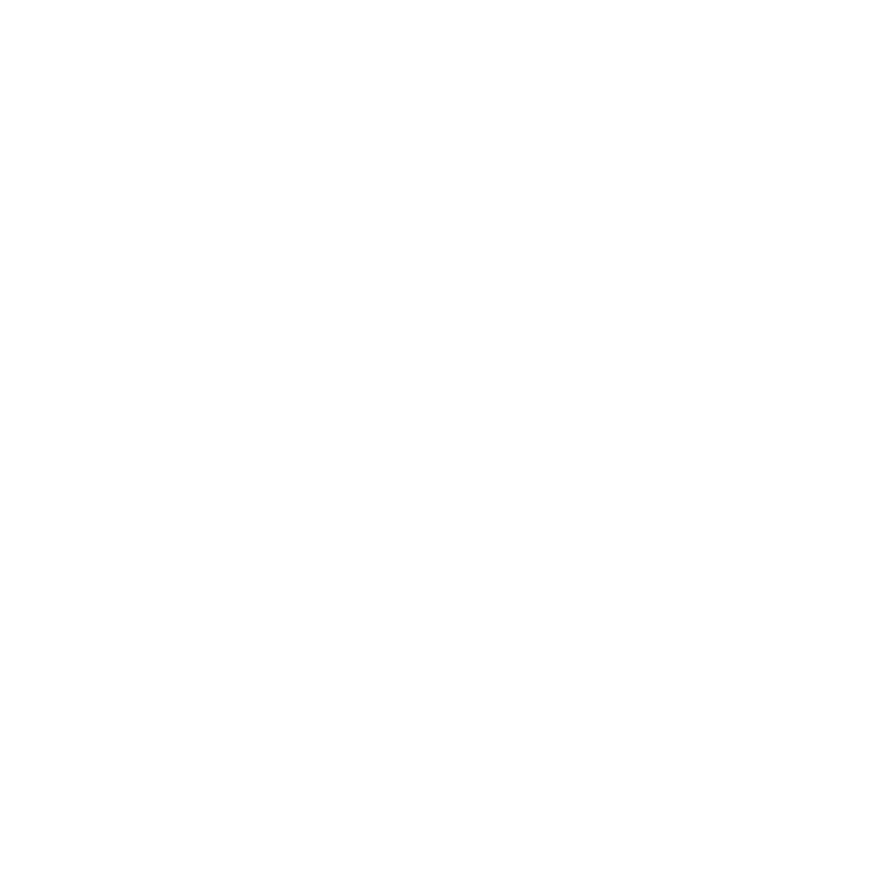

# IoT Hub

A simple and work-in-progress platform for sharing IoT projects. This project
is built with Next.js and Prisma, and aims to make it easy for users to share,
explore, and manage IoT projects and guides.

## Features

- User authentication (login, signup, account management)
- Project sharing and exploration
- User profiles
- Guides and community resources
- Mobile responsive design (in progress)

## To-Do List

- Implement project/guide creation
- Email verification
- UI Polishing
- Mobile responsiveness
- 2FA
- Github/Google login
- Search functionality
- More to come

## Getting Started

1. Clone the repository
2. Install dependencies: `npm install`
3. Set up your database (see `prisma/schema.prisma`)
4. Run the development server: `npm run dev`

## Attributions

- Technology icons by Mayor Icons (Flaticon)
- User icons by Freepik (Flaticon)
- Report flag icon by Vectors Market (Noun Project)
- Pencil icons created by Pixel perfect - Flaticon
- Flag icons created by Smashicons - Flaticon
- Search icons created by Chanut - Flaticon
- Info icons created by Freepik - Flaticon
